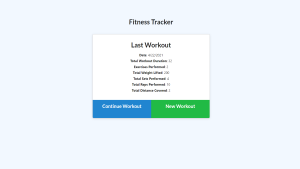
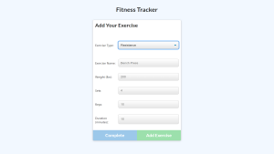
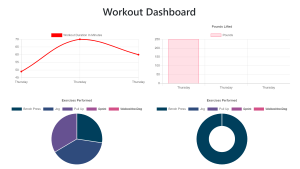

# Workout Tracker   
View and update your daily exercises to help reach your fitness goals. You are able to update current workouts with the name, type, and details of activities, as well as start a new workout. 

## Table of Contents

  * [Usage](#Usage)

  * [Demo](#Demo)

  * [Technologies](#Technologies)

  * [Links](#Links)

  * [License](#License)
  
  ## Usage
  Visit the live app via [Heroku](https://dry-wildwood-27410.herokuapp.com/)

  ## Demo
  

  

  
 

  ## Technologies
   * [MongoDb](https://www.mongodb.com/)
   * [MongoDb Atlas](https://www.mongodb.com/cloud/atlas)
   * [Mongoosejs](https://mongoosejs.com/)
   * [Express.js](https://expressjs.com/)
   * [Heroku](https://www.heroku.com)

  ## Links
  *  Go to Workout Tracker [Github Repository](https://github.com/ShaylaStevenson/workout-tracker)
  * View My [Github Profile](https://github.com/ShaylaStevenson)
  * You can also reach me through my [LinkedIn account](https://www.linkedin.com/in/shayla-stevenson-806143200/) .

  ## License
  This project is licensed under the terms of the MIT license. View license at:
  https://opensource.org/licenses/MIT.